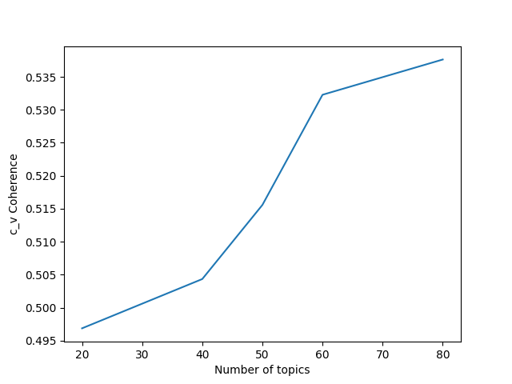
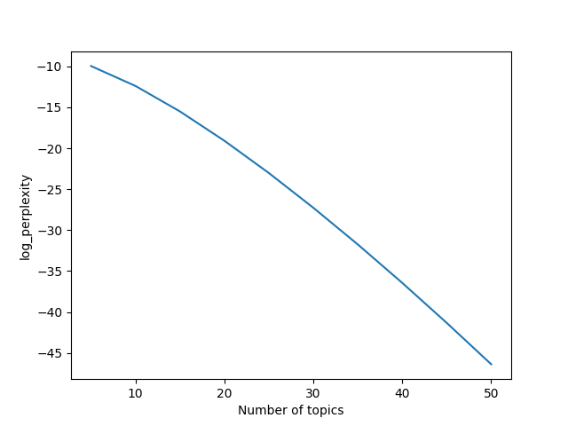
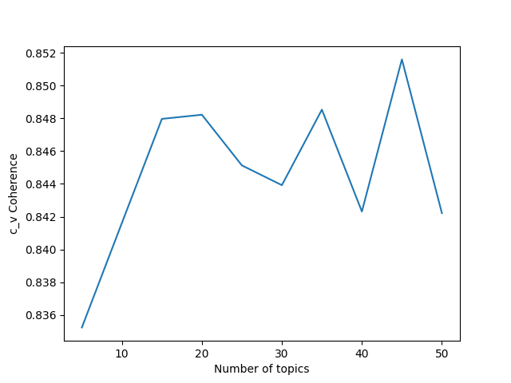
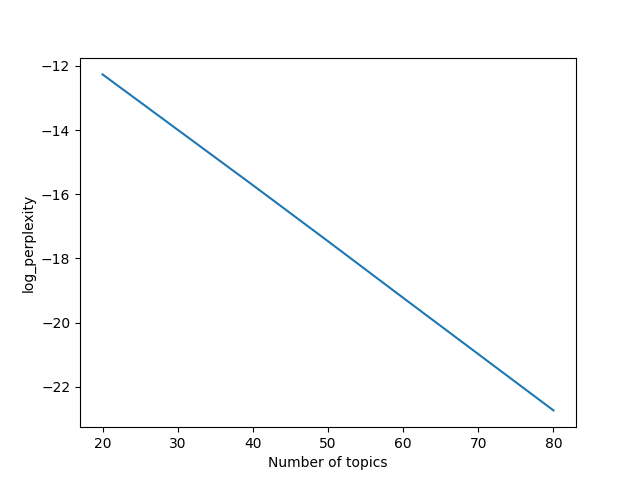

# Introduction

Since the beginning of the 2019-20 coronavirus pandemic, many scientific articles studying the COVID-19 disease and the coronavirus that causes it have been published. In addition, a large number of previously published articles, that describe useful, relevant background knowledge became popular. 

In response to this situation, the Allen Institute for AI constructed and made available the COVID-19 Open Research Dataset (CORD-19) [@CORD-19], a dataset containing metadata for over 47,000 articles which are relevant to COVID-19 and the coronavirus family of viruses. This dataset also includes the full text of over 36,000 of these articles. The intention was to mobilize researchers to analyse these data using contemporary techniques of text mining and natural language processing to generate insights in support of the fight against the corresponding disease. 

Based on the previous, and in the context of the [COVID-19 Biohackathon of April 2020](https://github.com/virtual-biohackathons/covid-19-bh20), we decided to analyse the CORD-19 dataset applying LDA [@LDA], a widely known topic modeling algorithm, to reveal a set of topics that are relevant to the corresponding texts. Our intention was to identify potentially interesting, latent topics and relationships that could help researchers better understand the domain and better organise their knowledge about it. As a result, we worked in the following tasks:

* We collected and preprocessed data from the CORD-19 dataset.  
* We applied LDA on the abstracts of the articles contained in the CORD-19 dataset.
* We developed a prototype interface to visualise the produced topics. 
* We performed a first attempt to interpret and evaluate the resulting topics.  

# Methods

## Data Collection 

We have collected the abstracts for xxx articles contained in the CORD-19 [@CORD-19] dataset. These abstracts have been extracted from the corresponding metadata file provided by the dataset. We used this set to create two collections: 

* CORD-19-ABS-ALL: It contains the abstracts of all the articles in the set.  
* CORD-19-ABS-2020: It contains only the abstracts of all articles in the set.

In both collections, only those articles having an abstract written in English were included. The reason was that using a multilingual training corpus for the topic model, could lead to language specific topics that may not carry any particular semantic clarity. Therefore, we used langdetect [@langdetect], a language detection library, to classify the abstracts based on their language and we ruled out all non-English abstracts. 

Our intention was to produce topics based on both collections. CORD-19-ABS-ALL is expected to provide more general topics, reflecting not only research focused on the current coronavirus outbreak but also research on relevant areas. On the other hand, CORD-19-AS-2020 is expected to produce more focused topics, specially tailored for the current disease, the relevant coronavirus, and the corresponding outbreak. 

Finally, it should be noted that we have also collected (for future use) all full texts of articles provided by CORD-19 and the tweets of one day (March 12th, 2020) from the COVID-19-TweetIDs dataset [@covid-19-tweetids]. 

## Topic Modeling

Using these two text collections described in the previous section (i.e., CORD-19-ABS-ALL and CORD-19-ABS-2020), we applied LDA and trained 10 and 6 topic models,respectively. After that, we utilsed the results based on model evaluation metrics and by manual inspection of the produced topics to select the best model for each collection. 

### Topic model training

Each text of the used collections was first passed through a preprocessing module that removes textual noise, normalizes the vocabulary and converts the text to more machine-readable form. During preprocessing, we used a part-of-speech tagger to detect terms that are nouns, adjectives and verbs and lemmatize them. We then proceeded by decapitalizing the text and removing terms that are stopwords, based on a defined stopword list. Punctuation was also removed with the exception of hyphens ("-") and slashes ("/"). We retained those as we've observed that were being commonly used in our dataset, for biological and medical notation. As a final preprocessing step, we excluded any text that after preprocessing had less than 5 terms.

The produced preprocessed texts were accumulated in a preprocessed text corpus and all terms that were being used in the corpus were recorded, creating a dictionary. The dictionary assigns a numeric unique ID from a specific range (commonly for a dictionary of size N, this range is [0,N-1]), to each term and maps each term to its number of occurences in the corpus and the number of documents the term appears in, thus providing a metric of significance and redundancy of each term. Terms with too few document occurences can be considered insignificant while ones that appear accross most of the documents can be considered as a stopword. This allows to limit the dictionary to terms that satisfy certain statistical conditions. Since our training dataset can be considered as rather small for topic modeling, we limit our dictionaries based on the filters described below, ordered by significance:

1. Keep terms regarding the COVID-19 pandemic, "coronavirus", "sars-cov-2", "covid-19" and "sars-ncov2"
2. Discard any term that appears in less than 2 documents
3. Discard any term that appears in more than 6% of the documents
4. Keep at most 30000 terms

Using the dictionaries that we produced above and based on the bag-of-words model, we transformed each text to a vector and passed it to an LDA model training. The vectors of each text represent the occurences of each dictionary term in that text; for each numeric ID of a dictionary term, the corresponding vector dimension contains the number of occurences of this term in the text. Each model is created with the desired number of topics and is supplied the constructed training text vectors. Through the whole set of text vectors the model attempts to distinguish the latent topics that the corpus texts discuss, as probability distributions of the dictionary terms.

In our case, following the procedure described above, we trained 6 LDA topic models (20, 40, 50, 60 and 80 topics), for the corpus of all the English abstracts that were provided by the CORD-19 dataset. As for the corpus of the English abstracts provided by the CORD-19 dataset and were published in 2020, we also trained 10 more LDA topic models (5, 10, 15, 20, 25, 30, 35, 40, 45, and 50 topics).

<!-- This project was developed in Python and used langdetect for the language filtering, nltk for the preprocessing methods and gensim implementation of the dictionary, LDA models and computation of the topic model evaluation metrics discussed below. -->

### Topic model evaluation

For the purpose of selecting the best models from the sets of models that derived from the two corpora, we employed the use of topic model perplexity and coherence metrics. Perplexity measures the ability of a trained model to generate texts that have not been witnessed during training while coherence provides a quantitative way of measuring inferred topics' interpretability. Utilization of these metrics can prove really helpful in comparing the produced models and designating the ones that show the best performance. A model's performance is proportional to its coherence score and inversely proportional to its perplexity. Below, we present the models sets' coherence and perplexity curves

* Coherence curve for models trained on all the English abstracts from CORD-19:
  

    
  

* Perplexity curve for models trained on all the English abstracts from CORD-19:
  

    
  

* Coherence curve for models trained on all the English abstracts from CORD-19, published in 2020:
  

    
  

* Perplexity curve for models trained on all the English abstracts from CORD-19, published in 2020:
  

    
  

Apart from the calculated metrics, models were also empirically evaluated based on the relevance between each topic's terms and their assigned relevant articles for each topic. Based on these, we concluded that from the two model sets, trained on the corpus of all CORD-19 English abstracts and on the corpus of CORD-19 English abstracts published in 2020, the two models that perform the best are the ones with the 60 and 40 topics, respectively.

## Prototype Interface

A prototype Web interface to demonstrate the produced topics has been developed using PHP, CSS, Javascript, and HTML. The interface is comprised of two basic pages. The first visualises the topics produced based on all the collected CORD-19 abstracts, while the second presents the topics based only on the abstracts of the 2020 articles (i.e., those that were published after the beginning of the outbreak). For both pages, only the best performing models (acccording to our initial evaluation and interpretation) are visualised. As a result, for the case of all articles, we used the model having 50 topics XXX, while for the case of 2020 articles we used the model XXX. 

# Discussion 

CoVid 2019 has been wreaking havoc on the face of the earth(1) since the December of 2019(2). At this time of hour, the scientific community has stood up to collaborate in order to curb this menace by exploring it.(3) Due to the novelty of the causative agent(4) & the pandemicity of the disease(5), the requirement of such effective collaborative efforts can not be overstated.(6) We, from our working group in the CoVid 2019- BH20, played our role by coming up with LDA topic models on a massive amount of textual data obtained from as much as over 47 000 scientific articles, including the full text of as much as 36 000 research articles, furthering the efforts to understand the mechanisms at play behind this one-in-a-century phenomenon.

The psychological effects of CoVid 2019(7)(8)(9)(10)(11) are coming out to have a destructive effect on all the facets of the society- healthcare apparatus personal & the common citizens alike. A significant relevance is detected by our models for words such as ‘stress’ & ‘anxiety’. Absence of specific antiviral consensus therapy(12) & an effective vaccine(13) & widespread panic associated with the fear of having the PPEs & face masks’ stockpiles depleted(14) is evident everywhere. The associated economic slowdown is stoking the fire.(15)

The understanding that masks are the primary line of defense against the spread of the disease(16) is observed to be a common theme. Although universal face mask usage has been discouraged, on the premise that they are unable to provide effective protection from the respiratory infections(17), their efficacy as a prominent member of the protection-protocol for vulnerable sections of the society can not be denied.(18)(19)(20)(21)(22) However, the use of facemasks in low-risk areas, where sustained human-to-human transmission is yet to occur, is not a smart mitigation strategy to adopt.(23) A scale to gauge the requirement of enacting the protocol of using facemasks as a preventive measure, against CoVid 2019 in particular & novel infections’ epidemic in general, is a dire need of time.(24)
 

# Future work

We plan to extend this work in the future in the following ways:

* We plan to train more topic models, using extra COVID-19-related text. For example, we plan to apply LDA on the available full-texts of CORD-19 dataset or on corpora of relevant tweets (e.g., [@covid-19-tweetids]). 
* We plan to examine alternative topic modeling algorithms like hLDA [@hLDA] and LSA [@LSA] and to evaluate the quality of their results in comparison to the LDA results. 
* We plan to extend the developed prototype to provide more useful features that can help scientists to generate useful insights about COVID-19 and relavenat issues. 

# Code and Data availability

A Github repository containing all relevant codes and data can be found here:

* [Cord19-topics Github page](https://github.com/vergoulis/cord19-topics)

# Acknowledgements
This work was done within the [COVID-19 Biohackathon of April 2020](https://github.com/virtual-biohackathons/covid-19-bh20).

# References

Leave thise section blank, create a paper.bib with all your references.
